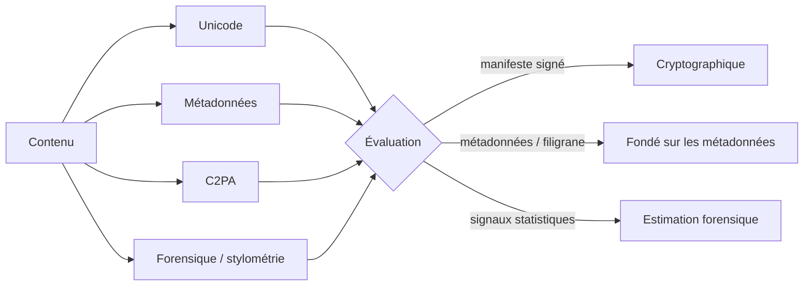

<div align="center">


# AI Inspector

**Est-ce que ça a été fait par une IA ? Une réponse fondée sur des preuves, calculée dans votre navigateur.**

Analyse d'origine IA libre et open source pour le texte, le code et les images.
Chaque verdict est accompagné de ses preuves et d'un niveau de confiance honnête.

[](https://github.com/rodolphe37/ai-inspector/actions/workflows/ci.yml)
[](LICENSE)


[](CONTRIBUTING.md)

[English](README.md) · **Français**

</div>

---

## Sommaire

- [Pourquoi AI Inspector](#pourquoi-ai-inspector)
- [Fonctionnalités](#fonctionnalités)
- [Comment un verdict est construit](#comment-un-verdict-est-construit)
- [Confidentialité](#confidentialité)
- [Démarrage rapide](#démarrage-rapide)
- [Structure du projet](#structure-du-projet)
- [Auto-hébergement](#auto-hébergement)
- [Documentation](#documentation)
- [Contribuer](#contribuer)
- [Licence](#licence)

## Pourquoi AI Inspector

La plupart des « détecteurs d'IA » renvoient un score opaque. AI Inspector fait
l'inverse : il recherche des **signaux connus et vérifiables**, vous dit lesquels
il a trouvés et indique **à quel point la conclusion est fiable**.

- Un **manifeste C2PA signé** déclarant une génération par IA est une preuve quasi certaine.
- Des **métadonnées de générateur** ou un marqueur de filigrane sont un indice fort, mais falsifiable ou supprimable.
- Une **estimation forensique ou stylométrique** n'est qu'une estimation, et elle est présentée comme telle.

L'absence de signal n'est jamais présentée comme une preuve d'origine humaine.

## Fonctionnalités

| | |
|---|---|
| **Content Credentials C2PA** | Lecture complète du manifeste et validation de la signature (bibliothèque officielle `c2pa` en WASM). |
| **Métadonnées de générateur** | Signatures EXIF / XMP / IPTC / PNG (Stable Diffusion, Midjourney, Firefly, DALL·E…) et `DigitalSourceType` IPTC. |
| **Forensique d'image** | Artefacts de suréchantillonnage (domaine fréquentiel), résidu de bruit de capteur, dimensions natives des générateurs. |
| **Stylométrie du texte (EN + FR)** | Variabilité, registre, vocabulaire prisé des LLM. La langue du texte est détectée et les références correspondantes sont utilisées. |
| **Stylométrie du code** | Densité et style des commentaires, docstrings, restes d'assistant, identifiants génériques. |
| **Détection « Trojan Source »** | Contrôles bidirectionnels et homoglyphes cachés dans le code source. |
| **Statistiques de lettres** | Test du χ² par rapport aux fréquences de référence anglaises ou françaises, entropie, p-value. |
| **Nettoyage de contenu** | Suppression locale de l'Unicode invisible et des métadonnées d'image, puis téléchargement. |
| **PWA bilingue** | Interface en anglais et en français, installable, fonctionne hors ligne une fois chargée. |
| **Sans compte, sans limite** | Tout est gratuit. L'historique et les réglages restent dans votre navigateur. |

## Comment un verdict est construit



Le verdict est l'un de `ai_confirmed`, `ai_likely`, `ai_possible`, `inconclusive`,
`no_evidence` ou `human_declared`, toujours affiché avec sa base de confiance et
la liste des signaux qui y ont contribué.

## Confidentialité

- **Toute l'analyse s'exécute dans le navigateur.** Les fichiers et textes ne sont jamais envoyés.
- **Ni compte, ni pistage.** L'historique et les réglages sont stockés dans IndexedDB, sur votre appareil.
- **Le serveur publie uniquement un catalogue public** des méthodes de détection connues
  (lecture seule, débit limité, aucune donnée utilisateur). L'application continue de
  fonctionner s'il est injoignable.

## Démarrage rapide

Prérequis : **Node.js 22+** et **Python 3.11+**.

```bash
git clone https://github.com/rodolphe37/ai-inspector.git
cd ai-inspector

# 1. API (SQLite par défaut, aucun service externe requis)
cd backend
make install && make seed && make dev        # http://localhost:8000

# 2. Application web (dans un autre terminal)
cd frontend
npm install && cp .env.example .env
npm run dev                                   # http://localhost:5173
```

Lancer les vérifications :

```bash
cd backend  && make test && make lint
cd frontend && npm run typecheck && npm run lint && npm run build
```

## Structure du projet

```
ai-inspector/
├── frontend/          React 19 · Vite · Tailwind 4 · i18next (PWA)
│   └── src/
│       ├── engine/    modules d'analyse (c2pa, metadata, aiImage, aiText, aiCode, assess…)
│       ├── i18n/      dictionnaires anglais + français, détection de la langue
│       ├── pages/     pages publiques et espace /app
│       └── lib/       stockage IndexedDB, client API
├── backend/           FastAPI · SQLAlchemy · Alembic (API du catalogue public)
├── docs/              guides d'architecture et de déploiement
├── render.yaml        Blueprint Render (API)
└── netlify.toml       configuration Netlify (application web)
```

## Auto-hébergement

- **Application web** : un build statique (`npm run build` dans `frontend/`) servi par
  n'importe quel hébergeur statique. Définissez `VITE_API_URL` au moment du build.
  [`netlify.toml`](netlify.toml) est fourni.
- **API** : l'image Docker de `backend/` (applique les migrations puis écoute sur
  `$PORT`) avec une `DATABASE_URL` PostgreSQL. Un Blueprint Render est fourni dans
  [`render.yaml`](render.yaml). Définissez `ENVIRONMENT=production` et `CORS_ORIGINS`
  avec l'origine de l'application web.

Tous les réglages de l'API sont décrits dans [`backend/README.md`](backend/README.md#configuration).

## Documentation

- [`docs/ARCHITECTURE.md`](docs/ARCHITECTURE.md) : l'assemblage des différentes parties
- [`frontend/README.md`](frontend/README.md) : application web, moteur, traductions
- [`backend/README.md`](backend/README.md) : API, configuration, sécurité
- [`CHANGELOG.md`](CHANGELOG.md) : notes de version

## Contribuer

Les contributions sont les bienvenues : signalements de bugs, méthodes de détection,
traductions, documentation. Lisez [`CONTRIBUTING.md`](CONTRIBUTING.md) et le
[code de conduite](CODE_OF_CONDUCT.md). Pour signaler une vulnérabilité, suivez
[`SECURITY.md`](SECURITY.md).

## Licence

[MIT](LICENSE). Les méthodes de détection implémentées sont décrites dans leurs
publications et standards respectifs, référencés dans le catalogue de l'application.

> **Avertissement.** AI Inspector recherche des signaux techniques connus. L'absence
> de signal ne prouve pas une origine humaine, et un signal statistique ne prouve pas
> une génération par machine.
