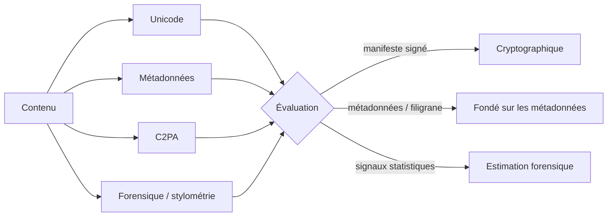

<div align="center">


# AI Inspector

**Est-ce que ça a été fait par une IA ? Une réponse fondée sur des preuves, calculée dans votre navigateur.**

Analyse d'origine IA libre et open source pour le texte, le code, les images, les documents PDF et Word, l'audio et la vidéo.
Chaque verdict est accompagné de ses preuves et d'un niveau de confiance honnête.

[](https://github.com/rodolphe37/ai-inspector/actions/workflows/ci.yml)
[](LICENSE)


[](CONTRIBUTING.md)

[English](README.md) · **Français**

</div>

---

## Sommaire

- [Pourquoi AI Inspector](#pourquoi-ai-inspector)
- [Fonctionnalités](#fonctionnalités)
- [Formats pris en charge](#formats-pris-en-charge)
- [Comment un verdict est construit](#comment-un-verdict-est-construit)
- [Confidentialité](#confidentialité)
- [Démarrage rapide](#démarrage-rapide)
- [Structure du projet](#structure-du-projet)
- [Auto-hébergement](#auto-hébergement)
- [Documentation](#documentation)
- [Contribuer](#contribuer)
- [Licence](#licence)

## Pourquoi AI Inspector

La plupart des « détecteurs d'IA » renvoient un score opaque. AI Inspector fait
l'inverse : il recherche des **signaux connus et vérifiables**, vous dit lesquels
il a trouvés et indique **à quel point la conclusion est fiable**.

- Un **manifeste C2PA signé** déclarant une génération par IA est une preuve quasi certaine.
- Des **métadonnées de générateur** ou un marqueur de filigrane sont un indice fort, mais falsifiable ou supprimable.
- Une **estimation forensique ou stylométrique** n'est qu'une estimation, et elle est présentée comme telle.

L'absence de signal n'est jamais présentée comme une preuve d'origine humaine.

## Fonctionnalités

| | |
|---|---|
| **Content Credentials C2PA** | Lecture complète du manifeste et validation de la signature (bibliothèque officielle `c2pa` en WASM). |
| **Métadonnées de générateur** | Signatures dans les images, l'audio, la vidéo et les documents (Stable Diffusion, ComfyUI, Midjourney, Firefly, Suno, ElevenLabs, Sora, Runway, ChatGPT…) et `DigitalSourceType` IPTC. |
| **Forensique d'image** | Artefacts de suréchantillonnage (domaine fréquentiel), résidu de bruit de capteur, dimensions natives des générateurs. |
| **Stylométrie du texte (EN + FR)** | Variabilité, registre, vocabulaire prisé des LLM. La langue du texte est détectée et les références correspondantes sont utilisées. |
| **Stylométrie du code** | Densité et style des commentaires, docstrings, restes d'assistant, identifiants génériques. |
| **Détection « Trojan Source »** | Contrôles bidirectionnels et homoglyphes cachés dans le code source. |
| **Statistiques de lettres** | Test du χ² par rapport aux fréquences de référence anglaises ou françaises, entropie, p-value. |
| **Nettoyage de contenu** | Suppression locale de l'Unicode invisible et des métadonnées de tous les formats pris en charge, puis téléchargement. Conservé dans l'historique. |
| **PWA bilingue** | Interface en anglais et en français, installable, fonctionne hors ligne une fois chargée. |
| **Sans compte, sans limite** | Tout est gratuit. L'historique et les réglages restent dans votre navigateur. |

## Formats pris en charge

Tout est analysé et nettoyé dans le navigateur. Le nettoyage ne retire que les
métadonnées : pixels, échantillons audio, images vidéo et texte des documents
restent identiques à l'octet près dès que le format le permet.

| Format | Extensions | Analyse | Nettoyage |
|---|---|---|---|
| **Texte** | collé, TXT, MD | Caractères invisibles, homoglyphes, contrôles bidi, stylométrie (EN / FR), statistiques de lettres | Caractères invisibles, homoglyphes, espaces de fin de ligne (retours forcés Markdown conservés) |
| **Code** | collé, JS, TS, PY, GO, RS, JAVA… | Trojan Source, caractères cachés, stylométrie du code | Caractères invisibles et bidi (lignes vides conservées) |
| **Images** | JPEG, PNG, WebP, GIF, HEIC, AVIF, TIFF | C2PA, EXIF / XMP / IPTC, blocs texte PNG, signatures de générateurs, forensique d'image | EXIF, XMP, IPTC, C2PA, blocs texte, sans perte (HEIC / AVIF / GIF réencodés en PNG) |
| **PDF** | PDF | Propriétés du document, XMP, C2PA, logiciel producteur, stylométrie du texte extrait | Propriétés, XMP, fichiers intégrés (dont C2PA), données PieceInfo |
| **Word** | DOCX | Propriétés auteur, application et personnalisées, stylométrie du texte | Propriétés auteur, application et personnalisées |
| **Audio** | MP3, WAV, FLAC, M4A, OGG | C2PA, balises ID3 / RIFF INFO / Vorbis / MP4, signatures de générateurs (Suno, Udio, ElevenLabs…) | ID3, APE, RIFF INFO, commentaires Vorbis, métadonnées MP4, C2PA, sans réencodage (OGG : analyse seulement) |
| **Vidéo** | MP4, MOV, AVI | C2PA, métadonnées du conteneur, signatures de générateurs (Sora, Runway, Veo, Pika, Kling…) | Boîtes de métadonnées et C2PA neutralisées sur place, sans réencodage |

Les nettoyages sont conservés dans l'historique (onglet dédié), avec ce qui a
été retiré et la taille des fichiers. Le contenu lui-même n'est jamais stocké.

## Comment un verdict est construit



Le verdict est l'un de `ai_confirmed`, `ai_likely`, `ai_possible`, `inconclusive`,
`no_evidence` ou `human_declared`, toujours affiché avec sa base de confiance et
la liste des signaux qui y ont contribué.

## Confidentialité

- **Tout s'exécute dans le navigateur.** Les fichiers et textes ne sont jamais envoyés ;
  le catalogue des méthodes de détection est intégré à l'application.
- **Ni serveur, ni compte, ni pistage.** AI Inspector est un site statique. L'historique
  et les réglages sont stockés dans IndexedDB, sur votre appareil, et s'effacent depuis
  les Réglages.

## Démarrage rapide

Prérequis : **Node.js 22+**.

```bash
git clone https://github.com/rodolphe37/ai-inspector.git
cd ai-inspector/frontend
npm install
npm run dev          # http://localhost:5173
```

Lancer les vérifications :

```bash
npm run typecheck && npm run lint && npm run build
```

## Structure du projet

```
ai-inspector/
├── frontend/          React 19 · Vite · Tailwind 4 · i18next (PWA)
│   └── src/
│       ├── engine/    modules d'analyse (c2pa, metadata, aiImage, aiText, aiCode, assess…)
│       ├── data/      catalogue intégré des méthodes de détection (EN + FR)
│       ├── i18n/      dictionnaires anglais + français, détection de la langue
│       ├── pages/     pages publiques et espace /app
│       └── lib/       stockage IndexedDB, utilitaires
├── deploy/            Docker Compose (Traefik) + guide d'auto-hébergement
└── docs/              guide d'architecture
```

## Auto-hébergement

AI Inspector est un site statique : aucune variable d'environnement, base de données
ni serveur n'est nécessaire.

- **Docker (recommandé) :** l'image de `frontend/Dockerfile` construit le site et le sert
  avec un nginx non privilégié (repli SPA, cache et en-têtes de sécurité). Une
  configuration Traefik et un déploiement GitHub Actions sont fournis : voir
  [`deploy/README.md`](deploy/README.md).
- **N'importe quel hébergeur statique :** `npm run build` dans `frontend/` produit
  `dist/` ; servez-le avec un repli sur `index.html` pour les routes côté client.

## Documentation

- [`docs/ARCHITECTURE.md`](docs/ARCHITECTURE.md) : l'assemblage des différentes parties
- [`frontend/README.md`](frontend/README.md) : application web, moteur, catalogue, traductions
- [`CHANGELOG.md`](CHANGELOG.md) : notes de version

## Contribuer

Les contributions sont les bienvenues : signalements de bugs, méthodes de détection,
traductions, documentation. Lisez [`CONTRIBUTING.md`](CONTRIBUTING.md) et le
[code de conduite](CODE_OF_CONDUCT.md). Pour signaler une vulnérabilité, suivez
[`SECURITY.md`](SECURITY.md).

## Licence

[MIT](LICENSE). Les méthodes de détection implémentées sont décrites dans leurs
publications et standards respectifs, référencés dans le catalogue de l'application.

> **Avertissement.** AI Inspector recherche des signaux techniques connus. L'absence
> de signal ne prouve pas une origine humaine, et un signal statistique ne prouve pas
> une génération par machine.
