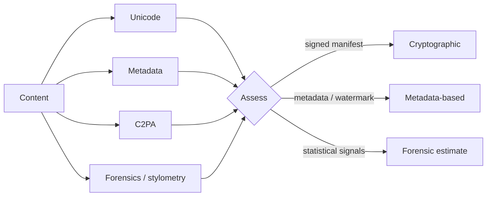

<div align="center">


# AI Inspector

**Was this made by AI? An evidence-based answer, computed in your browser.**

Free and open-source AI-origin analysis for text, code, images, PDF and Word documents, audio and video.
Every verdict comes with its evidence and an honest confidence level.

[](https://github.com/rodolphe37/ai-inspector/actions/workflows/ci.yml)
[](LICENSE)


[](CONTRIBUTING.md)

**English** · [Français](README.fr.md)

</div>

---

## Table of contents

- [Why AI Inspector](#why-ai-inspector)
- [Features](#features)
- [Supported formats](#supported-formats)
- [Detection catalogue](#detection-catalogue)
- [How a verdict is built](#how-a-verdict-is-built)
- [Privacy model](#privacy-model)
- [Quick start](#quick-start)
- [Project structure](#project-structure)
- [Self-hosting](#self-hosting)
- [Documentation](#documentation)
- [Contributing](#contributing)
- [License](#license)

## Why AI Inspector

Most "AI detectors" return a single opaque score. AI Inspector does the opposite:
it looks for **known, verifiable signals**, tells you which ones it found, and
states **how much you can trust the conclusion**.

- A **signed C2PA manifest** declaring AI generation is near-certain proof.
- **Generator metadata** or a watermark marker is a strong hint that can be forged or removed.
- A **forensic or stylometric estimate** is exactly that: an estimate, labelled as such.

An absence of signal is never presented as proof of human origin.

## Features

| | |
|---|---|
| **C2PA Content Credentials** | Full manifest parsing and signature validation (official `c2pa` WASM library), provider recognition (OpenAI, Adobe, Microsoft, Google, Samsung) and Durable Content Credentials. A camera-signed capture counts as proof of authenticity. |
| **Generator metadata** | Image, audio, video and document signatures (Stable Diffusion, ComfyUI, Midjourney, Firefly, Suno, ElevenLabs, Sora, Runway, ChatGPT…) and IPTC `DigitalSourceType`. |
| **Image forensics** | Frequency-domain up-sampling artifacts, sensor-noise residual, generator-native dimensions. |
| **Text stylometry (EN + FR)** | Burstiness, register, LLM-favoured vocabulary. The language of the text is detected and matching references are used. |
| **Code stylometry** | Comment density, tutorial comments, docstring coverage, assistant leftovers, generic identifiers. |
| **Trojan Source detection** | Bidirectional overrides and homoglyphs hidden in source code. |
| **Letter statistics** | χ² test against English or French reference frequencies, entropy, p-value. |
| **Detection catalogue** | 23 known methods, each with its status, confidence and references: see [Detection catalogue](#detection-catalogue). |
| **Content cleaning** | Strip invisible Unicode and the metadata of every supported format locally, then download. Kept in the history. |
| **Bilingual PWA** | English and French interface, installable, works offline once loaded. |
| **No account, no limits** | Everything is free. History and settings stay in your browser. |

## Supported formats

Everything is analysed and cleaned in the browser. Cleaning removes metadata
only: pixels, audio samples, video frames and document text are left byte for
byte identical wherever the format allows it.

| Format | Extensions | Analysis | Cleaning |
|---|---|---|---|
| **Text** | pasted, TXT, MD | Invisible characters, homoglyphs, bidi controls, stylometry (EN / FR), letter statistics | Invisible characters, homoglyphs, trailing whitespace (Markdown hard breaks kept) |
| **Code** | pasted, JS, TS, PY, GO, RS, JAVA… | Trojan Source, hidden characters, code stylometry | Invisible and bidi characters (blank lines kept) |
| **Images** | JPEG, PNG, WebP, GIF, HEIC, AVIF, TIFF | C2PA, EXIF / XMP / IPTC, PNG text chunks, generator signatures, image forensics | EXIF, XMP, IPTC, C2PA, text chunks, lossless (HEIC / AVIF / GIF re-encoded to PNG) |
| **PDF** | PDF | Document properties, XMP, C2PA, producing software, stylometry of the extracted text | Properties, XMP, embedded files (including C2PA), page-piece data |
| **Word** | DOCX | Author, application and custom properties, stylometry of the text | Author, application and custom properties |
| **Audio** | MP3, WAV, FLAC, M4A, OGG | C2PA, ID3 / RIFF INFO / Vorbis / MP4 tags, generator signatures (Suno, Udio, ElevenLabs…) | ID3, APE, RIFF INFO, Vorbis comments, MP4 metadata, C2PA, no re-encoding (OGG: analysis only) |
| **Video** | MP4, MOV, AVI | C2PA, container metadata, generator signatures (Sora, Runway, Veo, Pika, Kling…) | Metadata boxes and C2PA neutralised in place, no re-encoding |

Cleaning runs are kept in the history (their own tab), with what was removed
and the file sizes. The content itself is never stored.

## Detection catalogue

The 23 methods the analysis matches against, embedded in the app (browse them
under **Known fingerprints**). Status: **available** = reliably detected in
the browser; **research** / **experimental** = listed for transparency, the
detector is not public or the signal is only an estimate.

| Family | Method | Status |
|---|---|---|
| **Content Credentials (C2PA)** | C2PA manifest and signature | available |
| | OpenAI, Adobe Firefly, Microsoft, Google, Samsung Galaxy AI credentials | available |
| | Durable Content Credentials (soft binding: watermark or fingerprint that recovers stripped credentials) | available |
| | Camera-signed capture (Leica, Sony, Nikon, Canon, Fujifilm): **proof of authenticity**, a counter-signal that lowers the AI verdict | available |
| **Generator metadata** | IPTC `DigitalSourceType` (trained algorithmic media) | available |
| | EXIF / XMP software and AI tags | available |
| | Stable Diffusion web UI parameters (AUTOMATIC1111, Forge, SD.Next, Fooocus) | available |
| | ComfyUI workflow, InvokeAI, NovelAI, Midjourney metadata | available |
| | "Made with Google AI" credit | available |
| | AI tool named in file metadata: audio, video or documents (Suno, Udio, ElevenLabs, Sora, Runway, Veo, Pika, Kling, ChatGPT…) | available |
| **Text markers** | Invisible Unicode characters | available |
| | Homoglyph substitution | available |
| | N-gram frequency deviation | experimental |
| **Watermarks** | SynthID Text, SynthID image / audio / video (Google DeepMind) | research |
| | Green-list token watermark (KGW) | research |

## How a verdict is built



The verdict is one of `ai_confirmed`, `ai_likely`, `ai_possible`, `inconclusive`,
`no_evidence` or `human_declared`, always shown with its confidence basis and
the list of contributing signals.

## Privacy model

- **Everything runs in the browser.** Files and text are never uploaded; the
  catalogue of detection methods ships with the app.
- **No server, no accounts, no tracking.** AI Inspector is a static site. History
  and settings live in IndexedDB on your device and can be wiped from Settings.

## Quick start

Requirement: **Node.js 22+**.

```bash
git clone https://github.com/rodolphe37/ai-inspector.git
cd ai-inspector/frontend
npm install
npm run dev          # http://localhost:5173
```

Run the checks:

```bash
npm run typecheck && npm run lint && npm run build
```

## Project structure

```
ai-inspector/
├── frontend/          React 19 · Vite · Tailwind 4 · i18next (PWA)
│   └── src/
│       ├── engine/    analysis modules (c2pa, metadata, aiImage, aiText, aiCode, assess…)
│       ├── data/      embedded catalogue of detection methods (EN + FR)
│       ├── i18n/      English + French dictionaries, language detection
│       ├── pages/     public pages and the /app workspace
│       └── lib/       IndexedDB storage, helpers
├── deploy/            Docker Compose (Traefik) + self-hosting guide
└── docs/              architecture guide
```

## Self-hosting

AI Inspector is a static site: no environment variable, database or server is
needed.

- **Docker (recommended):** the image in `frontend/Dockerfile` builds the site
  and serves it with an unprivileged nginx (SPA fallback, cache and security
  headers). A Traefik setup and a GitHub Actions deployment are provided: see
  [`deploy/README.md`](deploy/README.md).
- **Any static host:** `npm run build` in `frontend/` produces `dist/`; serve it
  with a fallback to `index.html` for client-side routes.

## Documentation

- [`docs/ARCHITECTURE.md`](docs/ARCHITECTURE.md): how the pieces fit together
- [`frontend/README.md`](frontend/README.md): web app, engine, catalogue, translations
- [`CHANGELOG.md`](CHANGELOG.md): release notes

## Contributing

Contributions are welcome: bug reports, detection methods, translations, docs.
Read [`CONTRIBUTING.md`](CONTRIBUTING.md) and the [Code of Conduct](CODE_OF_CONDUCT.md).
To report a vulnerability, follow [`SECURITY.md`](SECURITY.md).

## License

[MIT](LICENSE). The detection methods it implements are described in their
respective publications and standards, linked from the in-app catalogue.

> **Disclaimer.** AI Inspector inspects content for known technical signals. An
> absence of signal does not prove human origin, and a statistical signal does not
> prove machine generation.
