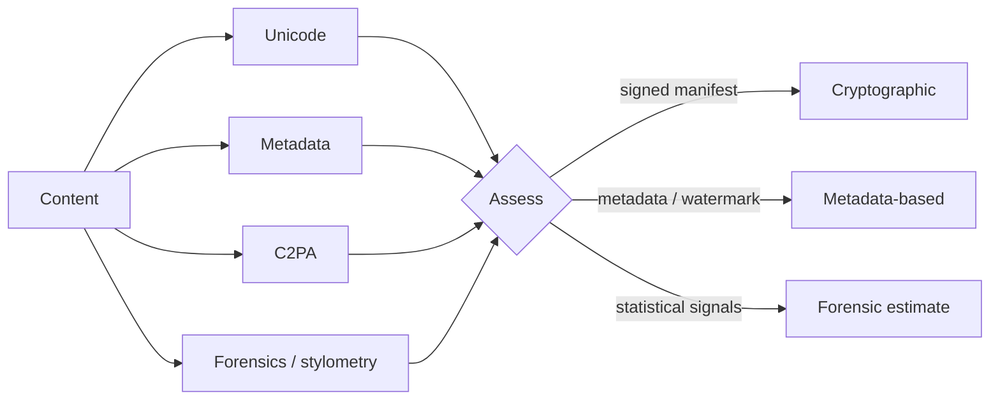

<div align="center">


# AI Inspector

**Was this made by AI? An evidence-based answer, computed in your browser.**

Free and open-source AI-origin analysis for text, code and images.
Every verdict comes with its evidence and an honest confidence level.

[](https://github.com/rodolphe37/ai-inspector/actions/workflows/ci.yml)
[](LICENSE)


[](CONTRIBUTING.md)

**English** · [Français](README.fr.md)

</div>

---

## Table of contents

- [Why AI Inspector](#why-ai-inspector)
- [Features](#features)
- [How a verdict is built](#how-a-verdict-is-built)
- [Privacy model](#privacy-model)
- [Quick start](#quick-start)
- [Project structure](#project-structure)
- [Self-hosting](#self-hosting)
- [Documentation](#documentation)
- [Contributing](#contributing)
- [License](#license)

## Why AI Inspector

Most "AI detectors" return a single opaque score. AI Inspector does the opposite:
it looks for **known, verifiable signals**, tells you which ones it found, and
states **how much you can trust the conclusion**.

- A **signed C2PA manifest** declaring AI generation is near-certain proof.
- **Generator metadata** or a watermark marker is a strong hint that can be forged or removed.
- A **forensic or stylometric estimate** is exactly that: an estimate, labelled as such.

An absence of signal is never presented as proof of human origin.

## Features

| | |
|---|---|
| **C2PA Content Credentials** | Full manifest parsing and signature validation (official `c2pa` WASM library). |
| **Generator metadata** | EXIF / XMP / IPTC / PNG signatures (Stable Diffusion, Midjourney, Firefly, DALL·E…) and IPTC `DigitalSourceType`. |
| **Image forensics** | Frequency-domain up-sampling artifacts, sensor-noise residual, generator-native dimensions. |
| **Text stylometry (EN + FR)** | Burstiness, register, LLM-favoured vocabulary. The language of the text is detected and matching references are used. |
| **Code stylometry** | Comment density, tutorial comments, docstring coverage, assistant leftovers, generic identifiers. |
| **Trojan Source detection** | Bidirectional overrides and homoglyphs hidden in source code. |
| **Letter statistics** | χ² test against English or French reference frequencies, entropy, p-value. |
| **Content cleaning** | Strip invisible Unicode and image metadata locally, then download. |
| **Bilingual PWA** | English and French interface, installable, works offline once loaded. |
| **No account, no limits** | Everything is free. History and settings stay in your browser. |

## How a verdict is built



The verdict is one of `ai_confirmed`, `ai_likely`, `ai_possible`, `inconclusive`,
`no_evidence` or `human_declared`, always shown with its confidence basis and
the list of contributing signals.

## Privacy model

- **All analysis runs in the browser.** Files and text are never uploaded.
- **No accounts, no tracking.** History and settings live in IndexedDB on your device.
- **The server only publishes a public catalogue** of known detection methods
  (read-only, rate-limited, no user data). The app keeps working if it is unreachable.

## Quick start

Requirements: **Node.js 22+** and **Python 3.11+**.

```bash
git clone https://github.com/rodolphe37/ai-inspector.git
cd ai-inspector

# 1. API (SQLite by default, no external service needed)
cd backend
make install && make seed && make dev        # http://localhost:8000

# 2. Web app (in another terminal)
cd frontend
npm install && cp .env.example .env
npm run dev                                   # http://localhost:5173
```

Run the checks:

```bash
cd backend  && make test && make lint
cd frontend && npm run typecheck && npm run lint && npm run build
```

## Project structure

```
ai-inspector/
├── frontend/          React 19 · Vite · Tailwind 4 · i18next (PWA)
│   └── src/
│       ├── engine/    analysis modules (c2pa, metadata, aiImage, aiText, aiCode, assess…)
│       ├── i18n/      English + French dictionaries, language detection
│       ├── pages/     public pages and the /app workspace
│       └── lib/       IndexedDB storage, API client
├── backend/           FastAPI · SQLAlchemy · Alembic (public catalogue API)
├── docs/              architecture and deployment guides
├── render.yaml        Render Blueprint (API)
└── netlify.toml       Netlify configuration (web app)
```

## Self-hosting

- **Web app**: a static build (`npm run build` in `frontend/`) served by any static
  host. Set `VITE_API_URL` at build time. [`netlify.toml`](netlify.toml) is provided.
- **API**: the Docker image in `backend/` (runs migrations, then serves on `$PORT`)
  with a PostgreSQL `DATABASE_URL`. A Render Blueprint is provided in
  [`render.yaml`](render.yaml). Set `ENVIRONMENT=production` and `CORS_ORIGINS`
  to your web-app origin.

All API settings are documented in [`backend/README.md`](backend/README.md#configuration).

## Documentation

- [`docs/ARCHITECTURE.md`](docs/ARCHITECTURE.md): how the pieces fit together
- [`frontend/README.md`](frontend/README.md): web app, engine, translations
- [`backend/README.md`](backend/README.md): API, configuration, security
- [`CHANGELOG.md`](CHANGELOG.md): release notes

## Contributing

Contributions are welcome: bug reports, detection methods, translations, docs.
Read [`CONTRIBUTING.md`](CONTRIBUTING.md) and the [Code of Conduct](CODE_OF_CONDUCT.md).
To report a vulnerability, follow [`SECURITY.md`](SECURITY.md).

## License

[MIT](LICENSE). The detection methods it implements are described in their
respective publications and standards, linked from the in-app catalogue.

> **Disclaimer.** AI Inspector inspects content for known technical signals. An
> absence of signal does not prove human origin, and a statistical signal does not
> prove machine generation.
