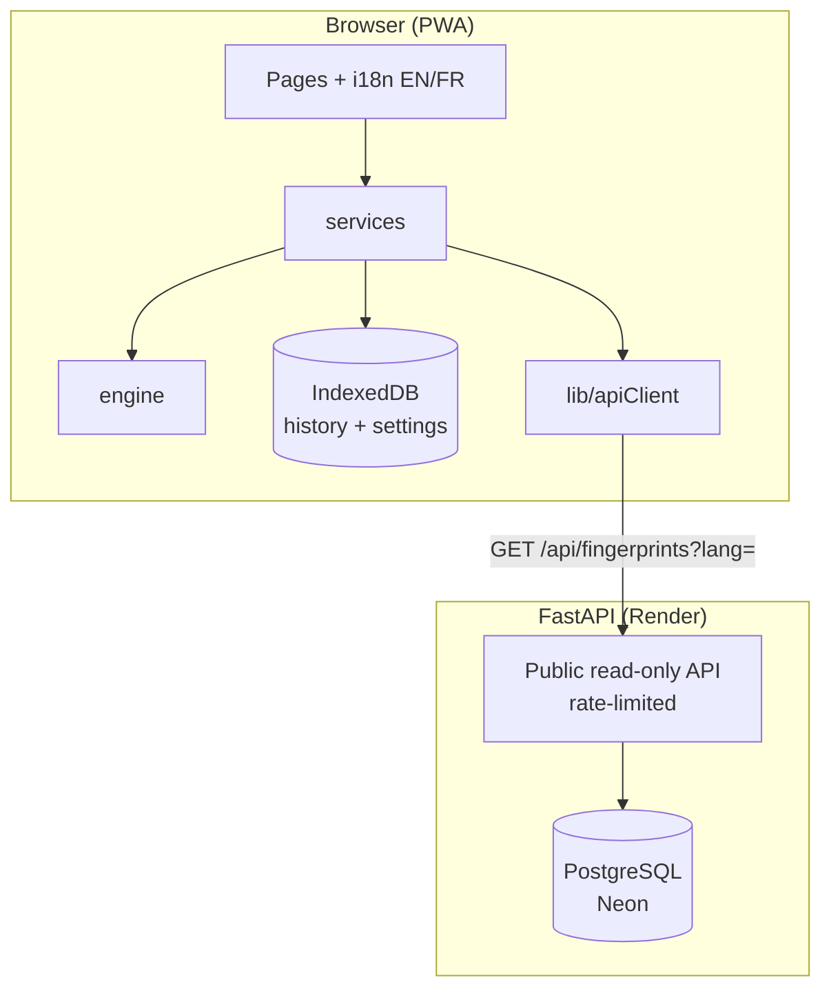

# Architecture

## Principle: analysis is local, the server is a public catalogue

AI Inspector is **local-first**. Every check (Unicode, metadata, C2PA, image
forensics, stylometry, statistics, fingerprint matching) runs in the browser in
`frontend/src/engine`. The FastAPI service never receives the content being
inspected and stores nothing about users. Its only job is to publish the
**fingerprint catalogue**: the list of known detection methods, in English and
French.



If the API is unreachable, analysis still works: the catalogue only enriches the
"Known fingerprints" section of a report.

## Frontend

```
frontend/src/
├── engine/        pure analysis modules (no React)
│   ├── index.ts        orchestrator: runs every module, builds the AnalysisResult
│   ├── c2pa.ts         official c2pa WASM: manifest + signature validation (lazy-loaded)
│   ├── metadata.ts     text metadata, EXIF / XMP / IPTC / PNG chunks (exifr)
│   ├── aiImage.ts      FFT up-sampling artifacts, noise residual, generator dimensions
│   ├── aiText.ts       prose stylometry, English and French profiles
│   ├── aiCode.ts       code stylometry
│   ├── language.ts     EN / FR detection of the analysed text, diacritic folding
│   ├── statistics.ts   χ² letter test against the detected language's reference
│   ├── unicode.ts      invisible chars, bidi controls, homoglyphs (Trojan Source)
│   ├── fingerprints.ts matches engine signals against the catalogue
│   ├── assess.ts       combines everything into one AI-origin verdict
│   ├── score.ts        provenance signal level + summary
│   └── clean.ts        Unicode / metadata stripping
├── i18n/          i18next setup + dictionaries (locales/en/*, locales/fr/*)
├── services/      runAnalysis, history / settings (IndexedDB), catalogue client
├── stores/        Zustand: settings, history
├── lib/           apiClient, localDb (idb), analysisStatus, constants
└── pages/         public pages + /app workspace
```

### Running an analysis

1. `Analyze.tsx` calls `runAnalysis(input)` (`src/services/index.ts`).
2. The catalogue is fetched (cached per language); a failure is non-fatal.
3. `analyzeContent` runs every engine module. There are no tiers or quotas.
4. `assess.ts` produces the verdict (`verdict`, `probability`, `confidence`
   basis, `signals[]`, `caveat`). Confidence ladder: **cryptographic** (valid
   C2PA) > **metadata** (generator tags, IPTC, watermark) > **statistical**
   (forensic estimate).
5. The result is saved in IndexedDB and `/app/results/:id` reads it back.

### Internationalisation

- `src/i18n/locales/en/*` is the source of truth; `fr/*` is typed against it, so
  a missing French key fails `npm run typecheck`.
- Language: saved choice (`localStorage`), else the browser language.
  `document.title`, `<html lang>` and the meta description follow it.
- The engine writes its explanatory text (basis, signal details, timeline) in
  the language active **at analysis time**; that text is stored with the result.
  Verdict labels, caveats and status badges are keyed and therefore re-translated
  on display.
- The analysed text's own language is detected separately (`engine/language.ts`)
  to pick the right stylometric profile and letter-frequency reference.

## Backend

```
backend/app/
├── main.py            app factory, middleware stack, /api/health
├── config.py          settings (env / .env), Neon URL normalisation
├── hardening.py       rate limiter, security headers, safe-methods filter
├── db.py              engine / session (psycopg 3, pooler-friendly)
├── models.py          Fingerprint (with `translations` JSON)
├── routers/fingerprints.py   GET list / detail, ?lang=en|fr
├── seed.py            idempotent catalogue seeding (runs at startup)
├── seed_data.py       catalogue (English)
└── seed_data_fr.py    French translations
```

### Middleware stack (outermost first)

1. **CORS**: only the configured web-app origins, `GET` only.
2. **Rate limiter**: fixed window per client IP (`RATE_LIMIT_PER_MINUTE`).
3. **Security headers + method filter**: CSP `default-src 'none'`, `nosniff`,
   `DENY` framing, HSTS in production; non-safe methods get `405`.
4. **GZip**, then optional **TrustedHost** (`ALLOWED_HOSTS`).

### Database

- **SQLite** by default (`init_db()` creates tables at startup). Used for local
  development and the test suite.
- **PostgreSQL** in production, driven by Alembic. The Docker image runs
  `alembic upgrade head` before starting. `render_as_batch` keeps the same
  migrations compatible with SQLite.
- Plain `postgres://` / `postgresql://` URLs (Neon) are rewritten to the
  psycopg 3 driver, and server-side prepared statements are disabled so the
  Neon pooled endpoint (PgBouncer) works.

## Tests and CI

- `backend/tests`: pytest on an isolated SQLite file, no network. Catalogue,
  French translations, security headers, rate limiting, method filtering,
  configuration.
- Frontend: `typecheck` (including translation completeness), `lint`, `build`.
- `.github/workflows/ci.yml` runs all of it on every push and pull request, and
  rejects the em dash character anywhere in the repository.
