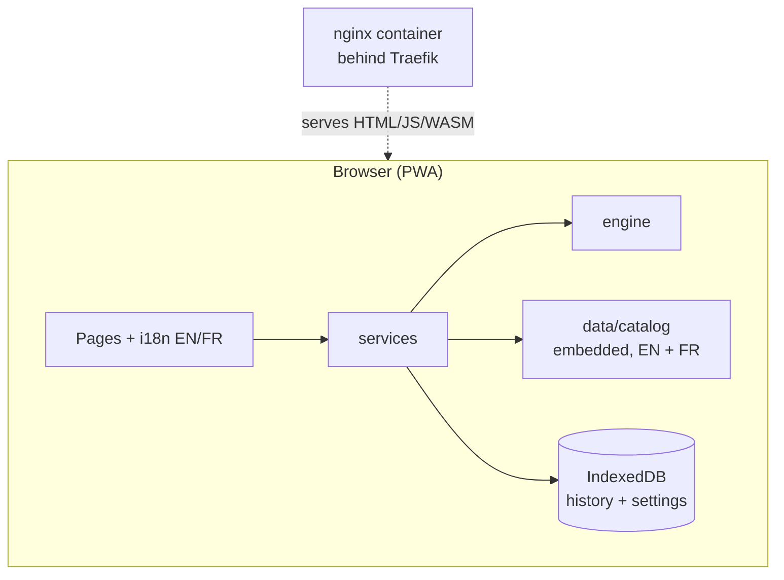

# Architecture

## Principle: everything runs in the browser

AI Inspector is a **static, local-first PWA**. There is no application server.
Every check (Unicode, metadata, C2PA, image forensics, stylometry, statistics,
fingerprint matching) runs in the browser in `frontend/src/engine`, and the
catalogue of known detection methods ships with the app (`frontend/src/data`).
Nothing about the user or their content ever leaves the device.



## Source layout

```
frontend/src/
├── engine/        pure analysis modules (no React)
│   ├── index.ts        orchestrator: runs every module, builds the AnalysisResult
│   ├── c2pa.ts         official c2pa WASM: manifest + signature validation (lazy-loaded)
│   ├── metadata.ts     file metadata: EXIF / XMP / IPTC / PNG chunks (exifr), audio, video and document tags
│   ├── containers.ts   format sniffing, tag readers and lossless strippers (JPEG, PNG, WebP, WAV, AVI, MP3, FLAC, MP4 / MOV / M4A)
│   ├── documents.ts    PDF (pdf.js, pdf-lib) and DOCX (fflate): text, properties, cleaning
│   ├── generators.ts   generator signatures, each looked for in the field its tool writes
│   ├── aiImage.ts      FFT up-sampling artifacts, noise residual, generator dimensions
│   ├── aiText.ts       prose stylometry, English and French profiles
│   ├── aiCode.ts       code stylometry
│   ├── language.ts     EN / FR detection of the analysed text, diacritic folding
│   ├── statistics.ts   χ² letter test against the detected language's reference
│   ├── unicode.ts      invisible chars, bidi controls, homoglyphs (Trojan Source)
│   ├── fingerprints.ts matches engine signals against the catalogue
│   ├── assess.ts       combines everything into one AI-origin verdict
│   ├── score.ts        provenance signal level + summary
│   └── clean.ts        text cleaning (language aware) and file cleaning for every format
├── data/catalog.ts    known detection methods, English + French text
├── i18n/              i18next setup + dictionaries (locales/en/*, locales/fr/*)
├── services/          runAnalysis, history / settings (IndexedDB), catalogue access
├── stores/            Zustand: settings, history
├── lib/               localDb (idb), analysisStatus, constants
└── pages/             public pages + /app workspace
```

## Running an analysis

1. `Analyze.tsx` calls `runAnalysis(input)` (`src/services/index.ts`).
2. `analyzeContent` runs every engine module. There are no tiers or quotas.
3. The engine signals are matched against the embedded catalogue.
4. `assess.ts` produces the verdict (`verdict`, `probability`, `confidence`
   basis, `signals[]`, `caveat`). Confidence ladder: **cryptographic** (valid
   C2PA) > **metadata** (generator tags, IPTC, watermark) > **statistical**
   (forensic estimate).
5. The result is saved in IndexedDB and `/app/results/:id` reads it back.

For a file, the bytes are sniffed first (`containers.ts`): the real format
decides which readers run, not the extension. PDF and DOCX text is extracted
and goes through the same text analyses as pasted text.

## Cleaning

`clean.ts` removes metadata without re-encoding wherever the format allows it:
JPEG / PNG / WebP segments and chunks are dropped, WAV is rebuilt, MP3 tags are
cut, FLAC metadata blocks are removed, and in MP4 / MOV / M4A / AVI the
metadata boxes are turned into same-size padding so every offset stays valid.
PDF properties, XMP and embedded files are removed with pdf-lib; DOCX
properties are blanked. Formats without a lossless path (HEIC, AVIF, GIF)
are re-encoded to PNG through a canvas, and OGG is refused rather than altered. Each run
is recorded in the `cleanings` store (name, type, what was removed, sizes; never
the content) when history is on.

## Catalogue

`src/data/catalog.ts` holds each method's metadata (type, status, confidence,
target content) and its text in English, with an optional `fr` block.
`localizedCatalog(lang)` returns the entries in the requested language, falling
back to English for untranslated fields. Updating the catalogue is a normal pull
request; the next deploy ships it.

## Internationalisation

- `src/i18n/locales/en/*` is the source of truth; `fr/*` is typed against it, so
  a missing French key fails `npm run typecheck`.
- Language: saved choice (`localStorage` key `ai.lang`), else the browser
  language. `document.title`, `<html lang>` and the meta description follow it.
- The engine writes its explanatory text (basis, signal details, timeline) in
  the language active **at analysis time**; that text is stored with the result.
  Verdict labels, caveats, status badges and the catalogue are re-translated on
  display.
- The analysed text's own language is detected separately (`engine/language.ts`)
  to pick the right stylometric profile and letter-frequency reference.

## PWA and hosting

`vite-plugin-pwa` precaches the build, so the app works offline once loaded. The
site is fully static. The Docker image serves it with nginx
([`frontend/nginx.conf`](../frontend/nginx.conf)): SPA fallback, cache headers
(immutable hashed assets, no-cache service worker) and security headers. See
[`deploy/README.md`](../deploy/README.md) for the Traefik setup and the
GitHub Actions deployment.

## Checks and CI

- `npm run typecheck` (including translation completeness), `npm run lint`,
  `npm run build`.
- `.github/workflows/ci.yml` runs them on every push and pull request, and
  rejects the em dash character anywhere in the repository.
